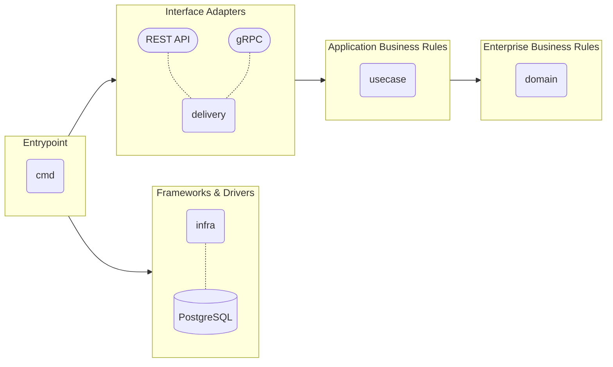

# clean-arch-prac
clean architecture with golang

## architecture diagram


## setup
```bash
# clone
git clone https://github.com/yach36/clean-arch-prac.git
cd clean-arch-prac
```
```bash
# set .env file
touch .env
```
```.env
# .envに下記を入力(本リポジトリは実運用しないので記載しているが, 普通は公開してはいけない)
POSTGRES_USER=user
POSTGRES_PASSWORD=password
POSTGRES_DB=test
```
```bash
# start server
docker compose build
docker compose up -d
```

## grpc server
https://github.com/yach36/clean-arch-prac/blob/main/docs/grpc.md

## REST API server
https://github.com/yach36/clean-arch-prac/blob/main/docs/api.md
